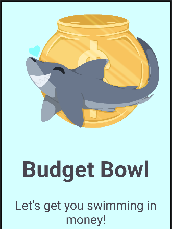
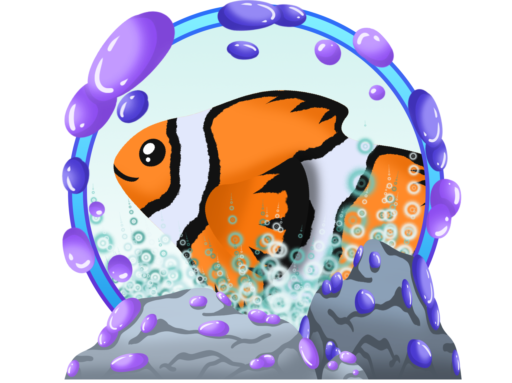
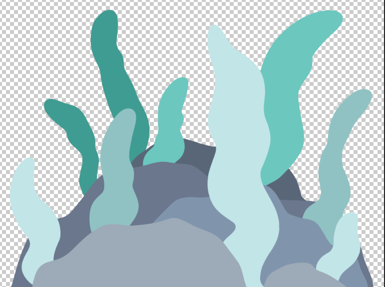

# Budget-Bowl

Budget Bowl is a gamified budgeting app engulfed with a theme of the sea. 
With our budgeting strategy based in the envelope budgeting method, we aim to provide a fun, and engaging way to let users interact with their finances. 
Our goal is to allow our users to make informed finacial decisions and develop a better sense of control and comfort when budgeting. 
We dont want you swimming in debt ... let us get you swimming in money !

## Where, When, How? 

To put it simply .. here...now...with us!
Budegt Bowl is made to be beginner frinedly. There is no need for prior knowledge. 
We aim to provide you with the tools you need to get a hold of your finances. 

We have designed this app to appear cute and harmless to reduce the stresses caused by finances regardless of finacial history. 
Our streamlined dashboard, helps you keep ontop of your goals with a quick glance.
Our Graph and Entry Review screens allow you to take a deeper dive into your spending life. 
All you need to do is set your goals, and keep us updated on your purchases and expenses. 

## App Features 

Basic Features include : 

- A sign up and login screen to ensure that you always have access to your finances.
- A set budget screen to set your target budget and provide your spending range.
- A create categories screen that allows you to make our own categories, assign individual budgets and set cute icons for easy recognition.
- An edit budget screen to ensure that you always have control over you own goals and finacial decisions.
- A main dashboard to provide quick and easily accessible information.
- An expense entry screen to allow you to add dates, descriptions and images so you can always keep track.
- The expense review screen gives you a filterable layout to analyse individual expenses
- The graph review screen provides a visual track of your progress within your set category goals

Gamified Features: 

- A Profile screen allowing you to change your icon and earn better icons as you progress in your goals.
- The Prize screens gives you award types to choose from when you earn enough points for a reward. The more you interact and engage, the more points you'll get.
- The Prize Tank is your very own display case, where all your awards will be kept. Now you can visualize your progress using cute little fishies.

  

## App Details 

Budget Bowl was made using Android Studios 
Front-end (User Interface) development was conducted using XML layouts 
Back-end development was created using the Kotlin coding language. 
Room-DB was the intial storage platform utilizing local storage . Storage is now  online and coordinated through Firebase.

Please note that the minimum SDK is 32 meaning that Android version 12 and up will work for this app but is not ideal. 
The target SDK is 36, making Android version 16 desirable. 

This project was made on a older version of Android Studio, so it is ideal that you have Android version 2025 1.1.12 for ideal implementation. 
Disclaimer: Github is known to interfere with Android Studio compilers and can result in the 'legal' failing, 

